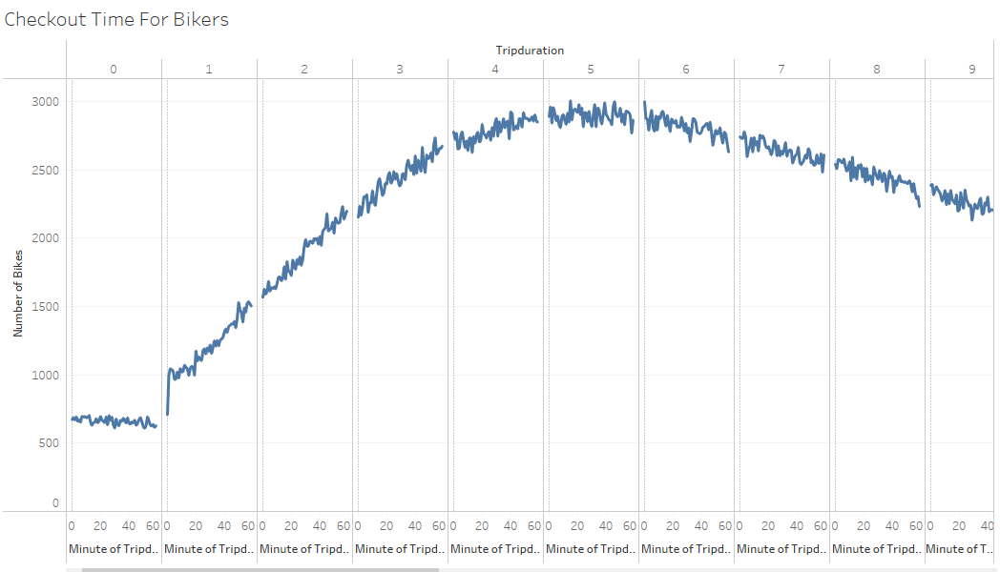
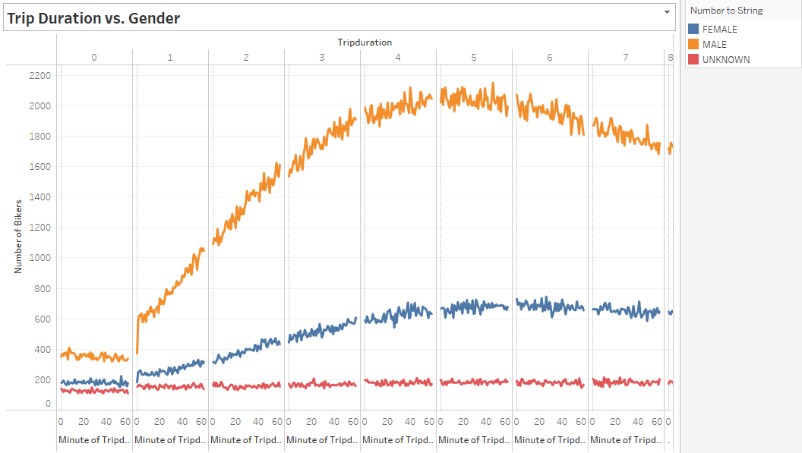
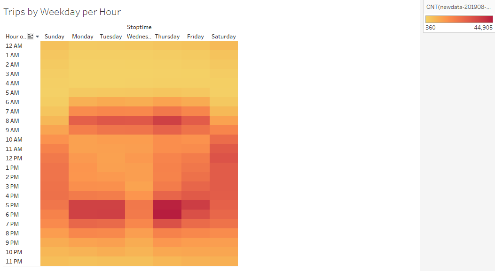
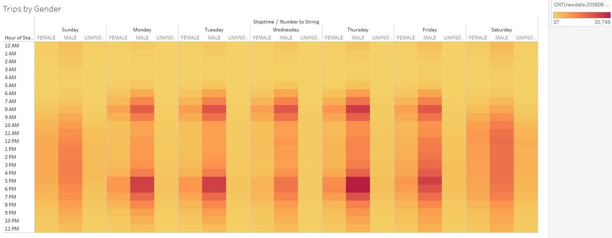
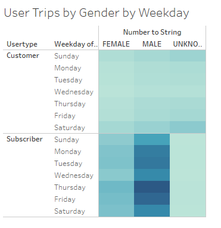

# Bike Sharing Analysis

## Tableau in New York City

In this project, I explored bike riding data throughout New York City. I looked at things like time out on a ride, sex of the person, city hotspots, and much more. Before I began this analysis, I had to make sure to convert the tripduration column in my csv file from an integer into a datetime datatype with the help of Pandas library and Python. From there, I was able to easily access the time element through Tableau to help create more visualizations. The code I used to perform this conversion is linked above in the NYC_CitiBike_Challenge.ipynb file. The purpose of this analysis was to learn more about the biking dat within New York City. If I could find out things like the biking hotspots, hours people rode most, biking stations most used, then I could help the company invest in prepare so their customers continue to be satisfied with their product. The results of this project will be discussed below.

## Results of Tableau Analysis

The first graphic I would like to discuss is about the number of rides by trip duration for our dataset broken down by hours in minutes. The results can be shown below.

To take this analysis one step further, I divided the number of riders from each gender and displayed the new graph below. As you can see, male rides tend to ride for a longer time than females and unknown riders. This graph is shown below.

I also wanted to analyze which days of the week were most popular to ride on. To display this, I divided the data by gender, day of the week, and time of day. One again, we see that male riders are riding the most. In addition, we can really see the peak riding hours in this chart. We can see that from Monday-Friday riding is most popular between the times of 7am-10am as well as Monday-Friday from 4pm-8pm. The results of this are shown in the plot below.

