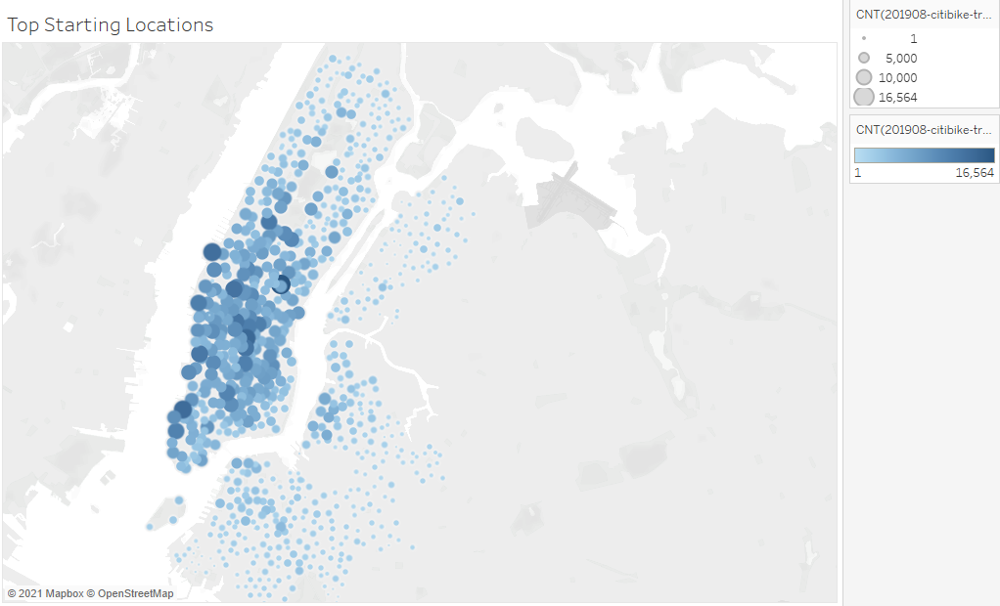
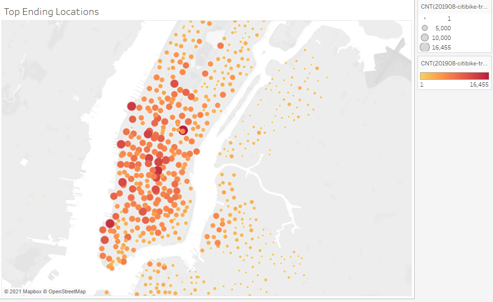

# Bike Sharing Analysis

## Tableau in New York City

In this project, I explored bike riding data throughout New York City. I looked at things like time out on a ride, sex of the person, city hotspots, and much more. Before I began this analysis, I had to make sure to convert the tripduration column in my csv file from an integer into a datetime datatype with the help of Pandas library and Python. From there, I was able to easily access the time element through Tableau to help create more visualizations. The code I used to perform this conversion is linked above in the NYC_CitiBike_Challenge.ipynb file. The purpose of this analysis was to learn more about the biking dat within New York City. If I could find out things like the biking hotspots, hours people rode most, biking stations most used, then I could help the company invest in prepare so their customers continue to be satisfied with their product. The results of this project will be discussed below.

## Results of Tableau Analysis

The first graphic I would like to discuss is about the number of rides by trip duration for our dataset broken down by hours in minutes. The results can be shown below.

To take this analysis one step further, I divided the number of riders from each gender and displayed the new graph below. As you can see, male rides tend to ride for a longer time than females and unknown riders. This graph is shown below.

I also wanted to analyze which days of the week were most popular to ride on. To display this, I divided the data by gender, day of the week, and time of day. One again, we see that male riders are riding the most. In addition, we can really see the peak riding hours in this chart. We can see that from Monday-Friday riding is most popular between the times of 7am-10am as well as Monday-Friday from 4pm-8pm. The results of this are shown in the plot below.

To take this analysis one step further, I wanted to see if the gender affected trips by weekday. Instead of clustering the gender data, I wanted to compare each side by side, so that I could see any anamolies in the dataset. Unfortunately, I really didn't find anything out of the ordinary. However, one thing I did notice was that females did not bike much during Monday-Friday from 10am-3pm, but on Saturday and Sunday they biked much more during this time frame. The results of this can be found on the heatmap below.

The last piece of data I wanted to explore was the customer vs. subscriber data for males, females, and unknown bikers. Once again, men dominated the subscriber trip count category for each day of the week, however I did notice for the customer count, the male and female data was very similar. One thought that popped into my head was that most males are subscribers to this service. The results to this can be found below.

Another plot I was able to generate through Tableau that I though could bring value to this project was displaying the start routes for bikers. This way, we could see which stations are being used the most and allocate our resources to ensure these stations succeed.

On the other hand, I also wanted to see which places were popular ending spots for routes. This could be important for moving bicycles during the night time. If we know one area will have tons of morning riders, while others are dead zones, we may want to move bikes for the users. A figure of common ending locations can be found below.

